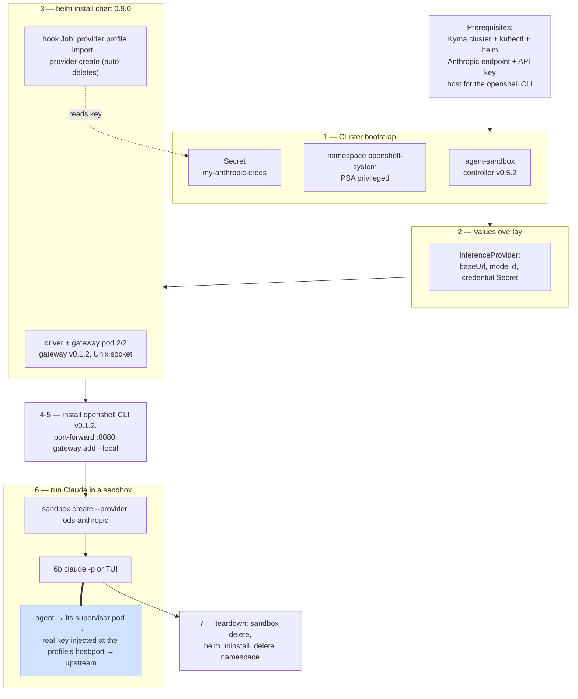

# Tutorial: OpenShell on Kyma with a direct Anthropic endpoint

End-to-end walkthrough for the simplest useful shape: one Kyma cluster,
one Anthropic-shaped API endpoint, one API key. No SAP AI Core, no
in-cluster LLM gateway, no OIDC. About 15 minutes from "empty cluster"
to Claude producing output inside an isolated sandbox on your cluster.


```mermaid
flowchart TB
    P["Prerequisites:<br/>Kyma cluster + kubectl + helm<br/>Anthropic endpoint + API key<br/>host for the openshell CLI"]

    subgraph S1["1 — Cluster bootstrap"]
        direction LR
        C1["agent-sandbox<br/>controller v0.5.2"]
        C2["namespace openshell-system<br/>PSA privileged"]
        C3["Secret<br/>my-anthropic-creds"]
    end

    subgraph S2["2 — Values overlay"]
        V["inferenceProvider:<br/>baseUrl, modelId, credential Secret"]
    end

    subgraph S3["3 — helm install chart 0.9.0"]
        POD["driver + gateway pod 2/2<br/>gateway v0.1.2, Unix socket"]
        HOOK["hook Job: provider profile import +<br/>provider create (auto-deletes)"]
    end

    S45["4-5 — install openshell CLI v0.1.2,<br/>port-forward :8080,<br/>gateway add --local"]

    subgraph S6["6 — run Claude in a sandbox"]
        CREATE["sandbox create --provider ods-anthropic"]
        RUN["6b claude -p or TUI"]
        PATH["agent → its supervisor pod →<br/>real key injected at the profile's host:port →<br/>upstream"]
    end

    S7["7 — teardown: sandbox delete,<br/>helm uninstall, delete namespace"]

    P --> S1
    S1 --> S2
    S2 --> S3
    HOOK -.reads key.-> C3
    S3 --> S45
    S45 --> CREATE
    CREATE --> RUN
    RUN === PATH
    RUN --> S7

    style PATH fill:#cfe2ff,stroke:#0a58ca
```

## What you're building

[OpenShell](https://github.com/NVIDIA/OpenShell) is NVIDIA's
open-source system for running AI agents inside locked-down sandboxes:
the platform holds the credentials and enforces network policy; the
agent inside never sees either. Four components appear throughout this
tutorial:

- **gateway** — the control plane. Serves the `openshell` CLI's gRPC
  API, stores providers, provider profiles and policies, and hands each
  sandbox its config. It never forwards inference traffic.
- **driver** (`openshell-driver-kyma`, this repo) — upstream OpenShell's
  Kubernetes driver with a thin Kyma layer. It turns the gateway's
  sandbox-lifecycle calls into `Sandbox` custom resources and pods; the
  two talk over a Unix socket inside a shared pod.
- **supervisor** — runs in its own hardened pod next to the agent's pod,
  one pair per sandbox. It enforces the isolation and network policy,
  and substitutes the real API key into requests to the provider's
  endpoint. The agent's traffic goes through it.
- **agent** — your workload (here: Claude Code), in the workload pod. It
  sees `ANTHROPIC_BASE_URL` and a placeholder key. It cannot read the
  real key or reach the upstream directly.

Deeper background: NVIDIA's
[Inference](https://docs.nvidia.com/openshell/how-it-works/inference)
page and the
["What's running, what's isolated"](walkthrough-claude-files.md#whats-running-whats-isolated)
section of the companion walkthrough.

The upstream gateway image comes from NVIDIA — nothing here needs a
fork build.

If you have an SAP AI Core service key instead of a plain Anthropic
key, use [`walkthrough-claude-files.md`](walkthrough-claude-files.md)
and its "SAP AI Core via the in-cluster translation bridge" variant.
If your upstream is a private LLM gateway inside another namespace in
your cluster, use [`getting-started.md`](getting-started.md) instead.

## Prerequisites

- **A Kyma cluster** you have `cluster-admin` on. Gardener, SAP BTP
  Trial, or Free Tier all work. `kubectl get ns` must succeed.
- **`kubectl` v1.27+** and **`helm` v3.12+**.
- **An Anthropic-shaped endpoint** — either `https://api.anthropic.com`
  or your own Anthropic-compatible URL (any proxy that exposes
  `POST /v1/messages` and speaks the Anthropic Messages API). The
  endpoint must be reachable from the internet or from your Kyma
  cluster's node egress.
- **An API key** that the endpoint accepts (`sk-ant-…` for real
  Anthropic; any key format your proxy expects otherwise).
- **A host to run the `openshell` CLI**. Linux, macOS, or Windows via
  WSL2. Native Windows is not supported by the CLI.

## 1. Cluster bootstrap

One-time cluster setup. Skip anything you've already done.

### 1a. Install the agent-sandbox controller

The chart's pre-install hook fails fast if this CRD is missing. v0.5.2 is the
release the chart's CI runs against.

```bash
kubectl apply -f https://github.com/kubernetes-sigs/agent-sandbox/releases/download/v0.5.2/sandbox.yaml
kubectl -n agent-sandbox-system rollout status \
  deployment/agent-sandbox-controller --timeout=120s
```

### 1b. Create the sandbox namespace with a privileged security level

Kubernetes'
[Pod Security Admission](https://kubernetes.io/docs/concepts/security/pod-security-admission/)
(PSA) restricts what pods in a namespace may do, via labels on the
namespace. Label the sandbox namespace `privileged`, the level the chart's
CI runs at. Upstream's sandbox pods run unprivileged (non-root, all
capabilities dropped), so a stricter level may admit them, but only
`privileged` is verified here, and the provider hook runs as root, which
`restricted` refuses.

```bash
NS=openshell-system
kubectl create namespace "$NS"
kubectl label namespace "$NS" \
  pod-security.kubernetes.io/enforce=privileged \
  pod-security.kubernetes.io/audit=privileged \
  pod-security.kubernetes.io/warn=privileged \
  --overwrite
```

### 1c. Store your Anthropic API key as a Secret

The chart never sees the key — it flows Secret → post-install
Job → gateway DB → sandbox supervisor at request time.

```bash
kubectl -n "$NS" create secret generic my-anthropic-creds \
  --from-literal=api-key='sk-ant-…'          # or whatever your endpoint expects
```

## 2. Values overlay

Create a `my-values.yaml` file. This is everything you need for the
direct-endpoint case:

```yaml
# my-values.yaml
namespace: openshell-system

driver:
  # Silences non-essential telemetry inside claude-code. Optional but
  # recommended so the agent's egress is only inference traffic.
  disableClaudeTelemetry: true

gateway:
  # Enable the in-pod gateway sidecar. The kyma driver won't work
  # without it (they talk over an in-pod Unix domain socket).
  enabled: true
  # Persist the gateway DB (provider profile and provider) across pod
  # restarts. Backed by a 1Gi PVC by default.
  dbPersistence:
    enabled: true
  sandboxJwt:
    enabled: true

gatewayService:
  # Expose the gateway on ClusterIP so the openshell CLI can reach it
  # via kubectl port-forward.
  enabled: true

inferenceProvider:
  enabled: true
  type: anthropic
  # Real Anthropic API. Change if you have your own Anthropic-shaped
  # endpoint. No trailing slash. Do NOT append /v1 — the SDK adds
  # /v1/messages itself.
  baseUrl: https://api.anthropic.com
  # Sandboxes receive this as ANTHROPIC_MODEL. Must be a model your
  # endpoint serves.
  modelId: claude-opus-4-7
  credentialSecret:
    name: my-anthropic-creds
    key: api-key
```

Notes on why this is short:

- **No NetworkPolicy setup for the upstream.** The agent's pod has no
  network of its own; its traffic goes through its supervisor pod, and
  upstream gives every supervisor pod an allow-all egress policy. A public
  `https://api.anthropic.com` and an in-cluster proxy such as
  `http://gateway.your-llm-ns.svc.cluster.local:8080/anthropic` both work with
  the values above. (0.8.0 needed a `gatewayUpstreamEgress` block for an
  in-cluster endpoint; it is gone.)
- **The provider profile comes from these values.** The chart renders a
  provider profile whose endpoint is the host and port of `baseUrl`
  (`api.anthropic.com:443` here) and whose `binaries` default to `node` and
  `claude` under `/usr/bin` and `/usr/local/bin`: claude-code runs under
  `node`. The API key is bound to that host and port.
- **No `gatewayApirule` / OIDC block.** Those are for exposing the
  gateway outside the cluster with browser-based auth. This tutorial
  uses `kubectl port-forward` to reach the gateway; auth stays
  unauthenticated-in-cluster.
- **No `bedrockBridge` block.** That's the SAP AI Core translation
  bridge — not needed if you have a plain Anthropic key.

## 3. Install the chart

```bash
helm install ods oci://ghcr.io/st-gr/charts/openshell-driver-kyma \
  --version 0.9.0 \
  --namespace "$NS" \
  -f my-values.yaml \
  --wait --timeout=300s
```

Expected result: `STATUS: deployed`, and a two-container pod
(`driver` + `gateway`) reaches `Running 2/2` in about 30–60 s.
Verify:

```bash
kubectl -n "$NS" get pods
kubectl -n "$NS" logs deploy/ods-openshell-driver-kyma -c driver --tail=5
# Look for: "Starting Kyma compute driver"
kubectl -n "$NS" logs deploy/ods-openshell-driver-kyma -c gateway --tail=50
# Look for: "Compute driver connected"
```

The last line proves the gateway is talking to the kyma driver over
the shared UDS. If it's missing, the driver container failed —
check its logs.

A post-install Job also runs once. It imports the provider profile
the chart rendered and creates the Anthropic provider from it on the
gateway (`ods-anthropic`, named `<release>-<type>`). On success helm
deletes the Job (hook delete-policy), so its absence is the normal
outcome — confirm via events, or via the CLI in step 5:

```bash
kubectl -n "$NS" get events --sort-by=lastTimestamp | grep inference-provider-hook
# Look for: "Completed   job/ods-openshell-driver-kyma-inference-provider-hook"
```

If the install instead timed out waiting on the hook, the failed
Job sticks around, so `kubectl -n "$NS" logs
job/ods-openshell-driver-kyma-inference-provider-hook` shows why; see the
[troubleshooting section in `getting-started.md`](getting-started.md#troubleshooting).

## 4. Install the openshell CLI

See [`install-cli.md`](install-cli.md) for the full matrix. For a
quick smoke test on Linux (or WSL2):

```bash
VERSION=v0.1.2
curl -fsSL "https://github.com/NVIDIA/OpenShell/releases/download/${VERSION}/openshell-x86_64-unknown-linux-musl.tar.gz" \
  | tar -xz -C /usr/local/bin
openshell --version
```

**Keep the CLI and the gateway on the same version.** The chart pins
the gateway to the upstream `v0.1.2` digest (see `values.yaml`), so install
the matching `v0.1.2` CLI. The gRPC contract does drift between releases: a
newer CLI against an older gateway can fail on individual commands whose
response shape changed. If you bump one, bump the other.

## 5. Reach the gateway + verify

Port-forward the in-cluster gateway to `localhost:8080`, then register
it with the CLI as the local default:

```bash
kubectl -n "$NS" port-forward svc/ods-openshell-driver-kyma 8080:8080 &
openshell gateway add --local http://localhost:8080
openshell status
# Server Status: OK
```

If `openshell status` says `missing authorization header`, the gateway
requires OIDC — you almost certainly set `gateway.oidc.issuer` in your
values file. Unset it for this tutorial (in-cluster only), or follow
[`production-deployment.md`](production-deployment.md) to wire OIDC end
to end.

## 6. Run Claude in a sandbox

The sandbox image `ghcr.io/st-gr/sandbox-claude:latest` bundles Node 22
and the `claude` CLI. You attach the provider from step 3 with
`--provider`: that gives the sandbox the placeholder key and the network
rule that admits `api.anthropic.com:443`. For what a sandbox
policy is and how to iterate on one, see NVIDIA's
[Policies](https://docs.nvidia.com/openshell/how-it-works/policies/overview)
and
[Policy schema](https://docs.nvidia.com/openshell/how-it-works/policies/schema).

Create the sandbox:

```bash
openshell provider list        # shows ods-anthropic, created by the chart's Job

openshell sandbox create \\
  --name hello \\
  --provider ods-anthropic \\
  --from ghcr.io/st-gr/sandbox-claude:latest \\
  --detach \\
  -- sleep infinity

openshell sandbox list         # hello ... Ready
```

`--detach` makes the command return once the gateway reports the sandbox
`Ready`. Every sandbox gets `ANTHROPIC_BASE_URL` and `ANTHROPIC_MODEL` from the
driver; only one created with `--provider` is given the key.

### 6a. Confirm the provider is attached

```bash
openshell sandbox provider list hello
openshell sandbox exec --name hello -- env | grep ANTHROPIC
```

Expect `ANTHROPIC_BASE_URL=https://api.anthropic.com`,
`ANTHROPIC_MODEL=claude-opus-4-7` and an `ANTHROPIC_API_KEY` that is a
placeholder, not your key. Leave the placeholder in place: do not export a key
of your own. The supervisor replaces it only in requests to the profile's host
and port.

### 6b. Run Claude Code

**Call the real binary, `/usr/bin/claude`.** The `claude` wrapper in this image
predates provider profiles and unsets `ANTHROPIC_API_KEY`, which would stop the
supervisor from substituting the real key. Set `HOME` to a writable path;
`/sandbox` is the sandbox's workspace.

Non-interactive (print mode):

```bash
openshell sandbox exec --name hello -- sh -c '
  export HOME=/sandbox
  /usr/bin/claude -p --bare --allow-dangerously-skip-permissions "Reply with exactly OK"'
```

Expected output: `OK`. `ANTHROPIC_MODEL` already names the model; if you pass
`--model`, it must be one your endpoint serves.

Interactive TUI (allocates a PTY automatically when your terminal is
interactive):

```bash
openshell sandbox exec --name hello -- sh -c 'HOME=/sandbox exec /usr/bin/claude'
```

If Claude fails, the cause is usually one of these:

- **`authentication_error`** — the Secret's `api-key` value is wrong. Recreate
  the Secret with the correct key and run `helm upgrade` with the same values
  file: the post-install Job runs again and updates the provider's key.
  Start a new process in the sandbox afterwards; a running process keeps the
  environment it started with.
- **`403` with `credential_endpoint_mismatch`** — the request went to a host
  or port other than the profile's endpoint, so the supervisor did not
  substitute the key. Check that `ANTHROPIC_BASE_URL` in the sandbox equals
  `inferenceProvider.baseUrl`, and that nothing overrides it.
- **The request is denied or times out** — the calling process is not one of
  `inferenceProvider.binaries` (claude-code runs under `node`; add the
  interpreter of any other SDK), or the sandbox was created without
  `--provider`. Add the binary, `helm upgrade`, and create a new sandbox.
- **`model_not_found`** — the model does not match one your endpoint
  serves; check `inferenceProvider.modelId` and any `--model` you passed.
- **`openshell sandbox create` says the provider or its profile is missing**
  — the gateway lost them (a restart with `gateway.dbPersistence.enabled`
  off). Run `helm upgrade` to re-run the Job, or enable persistence.

> **Why `claude -p` might appear to hang.** In print mode claude-code
> buffers all output until completion, so if the underlying inference
> call fails, you see silence rather than an error. If `claude -p`
> hangs, check the supervisor pod's log
> (`kubectl -n "$NS" logs os-supervisor-<id> --all-containers`; `<id>` is
> the lower-cased `openshell.ai/sandbox-id` label of the `hello` Sandbox CR,
> as shown in [`getting-started.md`](getting-started.md#inspect)).
> `--output-format stream-json --verbose` also surfaces the buffered error.

For the fuller flow (uploading a file, having Claude produce a new
file, downloading it) follow
[`walkthrough-claude-files.md`](walkthrough-claude-files.md) sections 7
onward.

## 7. Teardown

```bash
openshell sandbox delete hello
kill %1                                     # the port-forward
helm uninstall ods -n "$NS"
kubectl delete namespace "$NS"              # optional; wipes the JWT + TLS Secrets too
```

The kubernetes-sigs agent-sandbox controller stays installed
cluster-wide — remove it separately with a matching
`kubectl delete -f https://…/sandbox.yaml` if you no longer need it.

## What to change if your setup is different

- **Your endpoint is an Anthropic-shaped proxy inside your Kyma cluster
  (private).** Set `inferenceProvider.baseUrl` to the in-cluster URL
  (`http://gateway.your-llm-ns.svc.cluster.local:8080/anthropic` or
  similar). Nothing else is needed: the profile's endpoint follows the URL's
  host and port. See [`getting-started.md`](getting-started.md) Appendix A
  "Full install".
- **You want to hit real Anthropic via SAP AI Core** (SAP service key,
  Bedrock-shaped deployments). Use
  [`walkthrough-claude-files.md`](walkthrough-claude-files.md) with its
  bedrockBridge variant.
- **You want the CLI to run on a developer laptop over the public
  internet** (no port-forward). Set `gatewayApirule.enabled=true` and
  `gateway.oidc.issuer`. See
  [`production-deployment.md`](production-deployment.md).
- **You want to route inference through SAP Cloud Connector.** See
  [`cloud-connector-setup.md`](cloud-connector-setup.md).

## Versions

This tutorial targets chart `openshell-driver-kyma` `0.9.0`, which deploys
upstream NVIDIA OpenShell `v0.1.2`: the gateway, supervisor and sandbox
runtime images are pinned by digest to that release, and the CLI you install
in step 4 must be the same release. The agent-sandbox controller is v0.5.2.
The chart's CI installs the chart against a real gateway image and follows a
sandbox to Ready, through bootstrap and a stop/start round-trip; inference
through a provider (step 6) is not part of that run.
